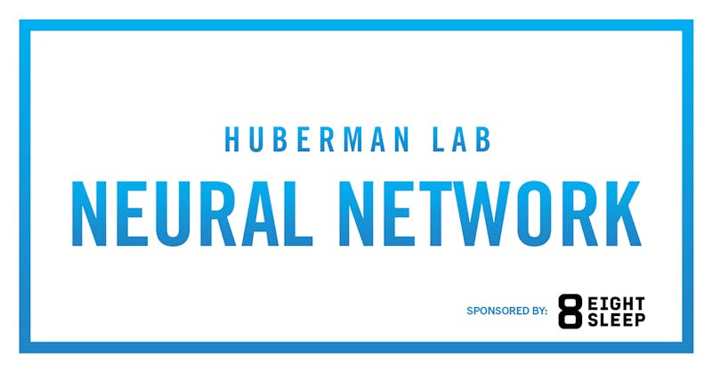

Type: Web Clip
URL: https://www.hubermanlab.com/topics/sleep-hygiene
Created: May 19, 2024 5:02 PM
Updated: June 14, 2025 9:36 PM

# Huberman Lab: Improve Sleep

Prioritize a consistent sleep schedule

- It is crucial to wake up at the same time (+/- 1 hour) each morning, days off included.
- Sleeping in later than that on the weekend is likely going to disrupt your circadian rhythm and make waking on your regular schedule that much harder.

Use breathing to promote relaxation

- Physiological sighing rapidly shifts the autonomic nervous system towards a state of increased calm.
- Even just 1–3 cyclic sighs can be effective, and if repeated as a short
breathwork practice for five minutes a day, it has been shown in a clinical trial to improve sleep, lower resting heart rate and enhance mood around the clock.
- To practice:
    - Take a deep inhale followed by a second, ‘top-off’ inhale to maximally inflate the lungs.
    - Release all your air with a full “lungs-to-empty” exhale.
    - Repeat 2–3x.

Optimize your sleep environment

- Start dimming the lights shortly after sunset and avoid overhead and bright lights in general.
- Dim computer and phone screens as much as possible, or use a red-hued filter to reduce blue light exposure.
- Cool your bedroom to 1–3 degrees lower than usual.
- Make your room as dark as possible using blackout blinds or an eye mask.
- If you wake up in the middle of the night, use NSDR to promote relaxation and support falling back asleep quickly.

In the [guest series](https://click.convertkit-mail4.com/4zu46m753pheh5e3579brf309x777b5/58hvh7hm3r2mlet7/aHR0cHM6Ly95b3V0dWJlLmNvbS9wbGF5bGlzdD9saXN0PVBMUE5XX2dlclhhNE9veXBVRWdaSTd1b3VJMTJXWnJ4ZVMmc2k9MHZPZWpFd1Foc2wxb21LNg==) with [Dr. Matthew Walker](https://click.convertkit-mail4.com/4zu46m753pheh5e3579brf309x777b5/qvh8h7hre9pre7ag/aHR0cHM6Ly9haS5odWJlcm1hbmxhYi5jb20vcy9CZHFzb3o0Sw==), we explain how to [determine your sleep needs](https://click.convertkit-mail4.com/4zu46m753pheh5e3579brf309x777b5/g3hnh5h3g4w3glb3/aHR0cHM6Ly93d3cuaHViZXJtYW5sYWIuY29tL2VwaXNvZGUvZ3Vlc3Qtc2VyaWVzLWRyLW1hdHRoZXctd2Fsa2VyLXRoZS1iaW9sb2d5LW9mLXNsZWVwLXlvdXItdW5pcXVlLXNsZWVwLW5lZWRz) and [improve sleep quality](https://click.convertkit-mail4.com/4zu46m753pheh5e3579brf309x777b5/9qhzhnhp4orp4xiz/aHR0cHM6Ly93d3cuaHViZXJtYW5sYWIuY29tL2VwaXNvZGUvZ3Vlc3Qtc2VyaWVzLWRyLW1hdHRoZXctd2Fsa2VyLXByb3RvY29scy10by1pbXByb3ZlLXlvdXItc2xlZXA=). This newsletter highlights key protocols from these episodes that will improve your ability to fall asleep, stay asleep and enhance the overall quality of your sleep.

# Sleep Fundamentals: QQRT

**Quantity:** the total amount of sleep. The typical adult needs sleep **7 to 9 hours of sleep per night**. This ensures sufficient time for both [deep sleep](https://click.convertkit-mail4.com/4zu46m753pheh5e3579brf309x777b5/n2hohvh32z032ki0/aHR0cHM6Ly95b3V0dS5iZS8tT0JDd2lQUGZFVT9zaT1OTV80ako5SDFocHE1UXcwJnQ9MTYyNw==) and [REM sleep](https://click.convertkit-mail4.com/4zu46m753pheh5e3579brf309x777b5/48hvhehrw48rw2fq/aHR0cHM6Ly95b3V0dS5iZS8tT0JDd2lQUGZFVT9zaT03VFVzb19wNnR6UnpUZHpNJnQ9MjUyMA==), so you wake up feeling refreshed and restored. Some people need less, others more, especially babies, teens, and those combating an illness or infection.

**Quality:** the continuity and structure of sleep. Frequent awakenings (even if you don’t remember) or **fragmented sleep** represent poor sleep quality.

- **Wearable sleep trackers** measure sleep quality through sleep efficiency scores. An efficiency rating of ≥ 85% is a good goal.
- *Note*: For some, sleep trackers can lead to anxiety about sleep quality (termed "**orthosomnia**"), which can paradoxically lead to disrupted sleep. Consider reviewing your sleep scores less often. For example, weekly, not daily, to minimize constant monitoring.
- For those who don’t use sleep trackers, poor sleep quality often manifests as excessive daytime sleepiness even if they slept sufficient total hours.

**Regularity:** stick to a consistent sleep schedule. Consistently going to bed and waking up at the same time each day leads to improved overall sleep patterns and quality by anchoring your body's circadian rhythm, or internal clock.

- Aim for **consistent bedtimes and wake times** with a ± 30 minutes margin of error, whether it’s the **weekend or a weekday.** No one is perfect about this, but that’s a good goal.
    - In addition to your morning alarm clock, consider adding a "**bedtime alarm**," which tells you when to go to sleep.
- Studies have [shown](https://click.convertkit-mail4.com/4zu46m753pheh5e3579brf309x777b5/wnh2hghwme6wmrsl/aHR0cHM6Ly9hY2FkZW1pYy5vdXAuY29tL3NsZWVwL2FydGljbGUvNDcvMS96c2FkMjUzLzcyODAyNjk=) that regular sleep patterns reduce all-cause mortality and may reduce the risk of cancer and cardiovascular disease more effectively than other metrics, such as sleep duration.

**Timing**: align your sleep schedule with your natural **chronotype** (morning person, night owl, versus typical sleep-wake schedule). Chronotype is primarily determined by genetics, and yet your preferred sleep time will vary a bit across your lifespan. You can find your natural chronotype using the [Morningness-Eveningness Questionnaire (MEQ)](https://click.convertkit-mail4.com/4zu46m753pheh5e3579brf309x777b5/reh8hoh0kgz0k0c6/aHR0cHM6Ly9xeG1kLmNvbS9jYWxjdWxhdGUvY2FsY3VsYXRvcl84MjkvbW9ybmluZ25lc3MtZXZlbmluZ25lc3MtcXVlc3Rpb25uYWlyZS1tZXE=). Sleeping out of sync with your chronotype will result in poorer quality sleep. But, of course, we have to adhere to life's demands as well.

# Determine Your Sleep Quality

Do you feel refreshed and restored when you wake up? Or do you feel you could sleep past your alarm? If you are in the latter group, the rest of this newsletter focuses on good **sleep hygiene tips** and **protocols to improve your sleep**. Following these protocols can significantly enhance sleep quality and, by extension, daily functioning and health.

# Sleep Hygiene Basics

### Light & Dark

**Melatonin** is a hormone that makes you feel sleepy; it does other things, too. Darkness allows the release of melatonin to signal the onset of sleep. Bright light, especially at night, potently inhibits melatonin. This causes you not to feel as sleepy and, consequently, to get poorer quality sleep.

- In the evening, **dim the lights** in your home to signal the body that it's time to wind down. Use **low-positioned lights** (rather than overhead) and yellow or, even better, deep orange/red lightbulbs, if available; they are less stimulating than typical lights.
- **Minimize screen time at night**. If you’re on a screen, dim it way down. Additionally, many computer operating systems show warmer colors at night. There are also apps like [f.lux](https://click.convertkit-mail4.com/4zu46m753pheh5e3579brf309x777b5/08hwh9hdn3rdn2fp/aHR0cHM6Ly9qdXN0Z2V0Zmx1eC5jb20v) (zero-cost) that allow for dimming.
- Add **blackout curtains** or wear an **eye mask** to maximize darkness in the bedroom.
- Upon waking, go outside for **10-15 minutes of morning sunlight**. Sunlight suppresses melatonin and resets your circadian rhythm. Morning sunlight also triggers cortisol release to help you wake up and stay more alert during the day. This is especially important on overcast days! You need sunlight, so it’s not necessary to see the sun directly, as plenty of light (photons) penetrate cloud cover.
    - If you can't get natural morning sunlight due to geographic location or schedule, artificial bright lights like [seasonal affective disorder (SAD) lamps](https://click.convertkit-mail4.com/4zu46m753pheh5e3579brf309x777b5/8ghqhohlwmnlwqul/aHR0cHM6Ly95b3V0dS5iZS9lSlU2RGZfZmZBRT9zaT1uVXF5a21LRVNZdUFibENWJnQ9Mjkx) are a decent substitute, though less effective.

### Temperature

Temperature plays a crucial role in sleep regulation. To fall asleep, **core body temperature must decrease** by approximately 2-3°F (1°C).

- Keep your **bedroom cool** (~67°F or ~19.4°C), or consider using a [temperature-controlled mattress cover](https://click.convertkit-mail4.com/4zu46m753pheh5e3579brf309x777b5/vqh3hrhpmzrpmguw/aHR0cHM6Ly93d3cuZWlnaHRzbGVlcC5jb20vaHViZXJtYW4=).
- Stick your hands or feet out from underneath the covers to help cool down.
- Taking a **warm bath or shower** before bedtime is a [science-supported](https://click.convertkit-mail4.com/4zu46m753pheh5e3579brf309x777b5/l2hehmh3q873qwhg/aHR0cHM6Ly93d3cuc2NpZW5jZWRpcmVjdC5jb20vc2NpZW5jZS9hcnRpY2xlL2Ficy9waWkvMDAxMzQ2OTQ4NTkwMDIyNz92aWElM0RpaHViJTI3) method to improve your ability to fall asleep and sleep deeply. Initially, the warm water raises core body temperature, but the subsequent cooling of your core body temperature that occurs after a hot bath or shower helps facilitate falling asleep.

### Food & Meal Timing

The effect of food on sleep largely depends on appetite, circadian rhythm, and personal preference. **Experiment with different foods and timing** to see what best supports your sleep.

- For most, eating approximately 2 hours before bedtime doesn’t typically impact sleep. Eating closer to bedtime [can increase the likelihood](https://click.convertkit-mail4.com/4zu46m753pheh5e3579brf309x777b5/m2h7h5h82dz822ul/aHR0cHM6Ly95b3V0dS5iZS9odlBHZmNBZ2s5WT9zaT1McE5mWngwc1RXZWtLdURRJnQ9MjQwMQ==) of **gastric reflux (heartburn)** and impair sleep in some individuals. Again, this is highly individual. If you do, make it a smaller snack or meal, but also don’t try to sleep while overly hungry. Most people can’t.
- **Avoid excessive fluid consumption** before bedtime to reduce the likelihood of waking up throughout the night.

### Caffeine

Caffeine does not reduce the need for sleep; it only temporarily masks sleepiness. Once caffeine wears off, a buildup of **adenosine,** a chemical that promotes sleepiness, causes a "**caffeine crash**," which usually occurs in the early afternoon.

- Caffeine timing is crucial for sleep quality. So, if you have trouble sleeping, don’t reach for a late afternoon cup of coffee. Instead, consume caffeine **early in the day** and not within **8-10 hours of bedtime**.
- Note: some people can sleep fine after ingesting caffeine in the afternoon or evening. This is likely due to tolerance and/or differences in how they metabolize caffeine. Do what works for you, but know that it can negatively affect sleep structure, including REM duration, in any case.

### Wind-Down Routine

Much like slowing down a car before stopping, a '**deceleration**' from the day’s activities is essential for good sleep. Establish a wind-down routine to prepare the body and mind for sleep:

- Engage in **relaxing activities**, such as meditation, listening to music, podcasts, sleep stories, or reading a book.
- **Avoid stimulating activities** before bed, such as watching television, reading the news, strenuous exercise, or social media.

### Alcohol

Alcohol is a sedative, **not a sleep aid**. While a 'nightcap' may help you get to sleep quickly, alcohol impairs the natural structure of sleep. Also, alcohol causes **fragmented sleep**.

# Trouble Falling Asleep?

**Walk It Out:** If it’s taking longer than **~20-25 minutes** to fall asleep or back asleep, leave your bed and go elsewhere in the house to engage in a relaxing activity. The goal is to **prevent an association** between a state of wakefulness and your bed, as this can lead to future difficulties falling asleep. Only return to bed when you are truly sleepy and be mindful not to fall asleep in another location; you want to relearn the association of sleep with the bedroom.

**Do Nothing:** After one poor night's sleep, **avoid compensatory behaviors** such as sleeping later, going to bed early, increasing caffeine intake, or excessively long or late-day napping. These behaviors can disrupt your natural circadian rhythms and may negatively affect sleep-wake cycles—in other words, they will make it hard to get back on your usual schedule.

**Mental Walk**: If you have trouble falling asleep, take a "mental walk" and **visualize walking a familiar route**. This technique will redirect your focus away from ruminating thoughts to help you fall asleep. One [study](https://click.convertkit-mail4.com/4zu46m753pheh5e3579brf309x777b5/dpheh0h0dln0dvil/aHR0cHM6Ly93d3cuc2NpZW5jZWRpcmVjdC5jb20vc2NpZW5jZS9hcnRpY2xlL2Ficy9waWkvUzAwMDU3OTY3MDEwMDAxMjI_dmlhJTNEaWh1Yg==) found this method significantly reduced the time it took participants to fall asleep, proving far more effective than the traditional approach of "counting sheep."

**Limit Daytime Naps**: Keep naps short (**≤ 20-30 minutes**) and no later than the **early to mid-afternoon** to avoid impacting your nighttime sleep.

These tips ought to greatly help optimize your sleep. Additionally, we have another popular newsletter, "[Toolkit for Sleep](https://click.convertkit-mail4.com/4zu46m753pheh5e3579brf309x777b5/e0hph7h0m8o0mvf7/aHR0cHM6Ly93d3cuaHViZXJtYW5sYWIuY29tL25ld3NsZXR0ZXIvdG9vbGtpdC1mb3Itc2xlZXA=)," which provides more actionable tools and protocols.

If you try these protocols and don’t notice a difference, you might be suffering from a **sleep disorder**. Seek professional help if you experience persistent problems, which might be due to **sleep apnea** or true **insomnia**.

## How to Recover From a Poor Night’s Sleep

If you’ve experienced a poor night’s sleep, your impulse may be to sleep in, drink a much-needed cup of coffee as you roll out of bed, and push your morning workout until the evening when you’re feeling up for it. But the best way to recover from a poor night’s sleep is to make sure it doesn’t affect your next night’s sleep.

Here are the most important protocols for recovering from short-term sleep deprivation:

- Get up at the same time as usual. Sleeping more than 1 hour past your usual wakeup time can shift your circadian clock later (called phase delay), making it harder to fall asleep that night.
- Ensure you get adequate sunlight exposure soon after waking to support a cortisol peak early in the day.
- Delay caffeine until 90–120 minutes after waking to maximize the energy-boosting effects of your cup of coffee or tea.
- Exercise in the morning to encourage an early-day cortisol peak and provide a boost in adrenaline and focus.
- If you’re feeling tired in the afternoon, avoid caffeine and take an afternoon nap or use a 10–30 minute NSDR protocol to recharge instead.

# Stay Connected

New Huberman Lab episodes are released every Monday on [YouTube](https://click.convertkit-mail4.com/4zu46m753pheh5e3579brf309x777b5/7qh7h8hodr5od5t9/aHR0cHM6Ly93d3cueW91dHViZS5jb20vQGh1YmVybWFubGFi) and all major podcast platforms, including [Apple Podcasts](https://click.convertkit-mail4.com/4zu46m753pheh5e3579brf309x777b5/owhkhqhrx2drxvcq/aHR0cHM6Ly9wb2RjYXN0cy5hcHBsZS5jb20vdXMvcG9kY2FzdC9odWJlcm1hbi1sYWIvaWQxNTQ1OTUzMTEw) and [Spotify](https://click.convertkit-mail4.com/4zu46m753pheh5e3579brf309x777b5/z2hghnh35qx352sz/aHR0cHM6Ly9vcGVuLnNwb3RpZnkuY29tL3Nob3cvNzlDa0pGM1VKVEhGVjhEc2UzT3kwUD9zaT1kNzMxYjc1MDQyNWM0NWUx). Please subscribe on YouTube and follow the podcast on Apple Podcasts and Spotify. I regularly post additional science and science-based tools on [Instagram](https://click.convertkit-mail4.com/4zu46m753pheh5e3579brf309x777b5/p8heh9hzrnozrnur/aHR0cHM6Ly93d3cuaW5zdGFncmFtLmNvbS9odWJlcm1hbmxhYi8=), [X (formerly Twitter)](https://click.convertkit-mail4.com/4zu46m753pheh5e3579brf309x777b5/x0hph6hwk50wkqug/aHR0cHM6Ly90d2l0dGVyLmNvbS9odWJlcm1hbmxhYg==), [Facebook](https://click.convertkit-mail4.com/4zu46m753pheh5e3579brf309x777b5/6qheh8h7xme7x3i9/aHR0cHM6Ly93d3cuZmFjZWJvb2suY29tL2h1YmVybWFubGFi), [Threads](https://click.convertkit-mail4.com/4zu46m753pheh5e3579brf309x777b5/kkhmh6hlzkvlzptk/aHR0cHM6Ly93d3cudGhyZWFkcy5uZXQvQGh1YmVybWFubGFi), and [LinkedIn](https://click.convertkit-mail4.com/4zu46m753pheh5e3579brf309x777b5/58hvh7hm3r2m3es7/aHR0cHM6Ly93d3cubGlua2VkaW4uY29tL2luL2FuZHJldy1odWJlcm1hbi8=).

We're always interested in feedback and encourage you to reply directly to this newsletter with your thoughts. While we can't always respond to each message, we do read each one.

Thank you for your interest in science™!

Best wishes,

Andrew

# **Eight Sleep**

I started using an Eight Sleep mattress cover over 3 years ago, and it has completely transformed my sleep. I fall asleep more quickly, sleep more deeply, and wake up far more refreshed than before.

Eight Sleep has just released their new Pod 4 Ultra. The Pod 4 Ultra features a more comfortable surface that doesn’t change the feeling of your mattress, with more cooling power, silent performance, and phone-free control, plus an adjustable base that adds snoring mitigation and custom elevation settings for sleeping, reading, and relaxing.

Eight Sleep ships to the United States, Canada, the United Kingdom, Europe, and Australia. Click below to access a special offer of up to $350 off Pod 4 Ultra.

[**Unlock $350 Off**](https://click.convertkit-mail4.com/4zu46m753pheh5e3579brf309x777b5/vqh3hrhpmzrpmguw/aHR0cHM6Ly93d3cuZWlnaHRzbGVlcC5jb20vaHViZXJtYW4=)

---