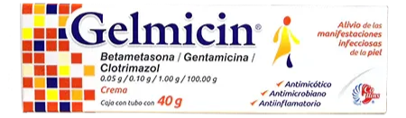

URL: https://www.youtube.com/watch?v=WPiE0Ijxn7k
Created: April 28, 2024 3:48 AM
Updated: June 14, 2025 9:36 PM

Current Prescriptions:

- AM:
    - [Clindamycin](https://pubchem.ncbi.nlm.nih.gov/compound/Clindamycin) (1%) and [Benzoyl Peroxide](https://pubchem.ncbi.nlm.nih.gov/compound/BenzoylPeroxide) (5%) Topical Gel
- PM:
    - [Tretinoin](https://pubchem.ncbi.nlm.nih.gov/compound/Tretinoin) (0.05%)
- Whitening Cream: [Hydroquinone](https://pubchem.ncbi.nlm.nih.gov/compound/Hydroquinone) Cream USP (4%) Skin Bleaching Cream

Old Prescriptions:

- Pill: [Minocycline](https://pubchem.ncbi.nlm.nih.gov/compound/Minocycline) (100mg x 2/day)
- AM:
    - [Winlevi](https://packhacker.com/packing-list/digital-nomad/): [Clascoterone](https://pubchem.ncbi.nlm.nih.gov/compound/Clascoterone) cream (1%)
- PM:
    - [Adapalene](https://pubchem.ncbi.nlm.nih.gov/compound/Adapalene) (0.3%) and [Benzoyl Peroxide](https://pubchem.ncbi.nlm.nih.gov/compound/BenzoylPeroxide) (2.5%) Topical Gel (clearing)
    - [Twyneo](https://www.twyneo.com/): [Tretinoin](https://pubchem.ncbi.nlm.nih.gov/compound/Tretinoin) (0.1%) and [Benzoyl Peroxide](https://pubchem.ncbi.nlm.nih.gov/compound/BenzoylPeroxide) (3%) Topical Gel

Day:

- CeraVe Hydrating Cleanser
- The Ordinary Azelaic Acid
- EltaMD UV Clear Sunscreen

Night

- CeraVe Foaming Cream Cleanser (4% BPO)
- [Differin](https://differin.com/shop/differin-gel) Gel: [Adapalene](https://pubchem.ncbi.nlm.nih.gov/compound/Adapalene) (0.1%)
- La Roche Posay Matte Moisturizer

Other Supplements:

- Gelmicin: [Betamethasone](https://pubchem.ncbi.nlm.nih.gov/compound/Betamethasone) (0.05%), [Gentamicin](https://pubchem.ncbi.nlm.nih.gov/compound/Gentamicin) (0.1%), and [Clotrimazole](https://pubchem.ncbi.nlm.nih.gov/compound/Clotrimazole) (1%)

- Acne Collection: [https://shopmy.us/collections/1296](https://shopmy.us/collections/1296)
- Exfolient: 2% BHA Liquid Exfoliant
- Dark Spot Corrector: [https://www.glamour.com/gallery/best-dark-spot-corrector](https://www.glamour.com/gallery/best-dark-spot-corrector)

## Old Skincare Routine

### Morning (AM)

1. [GL Acne Clearing Cleanser](https://www.glytone-usa.com/acne-clearing-cleanser) (6.7 oz): Dispense a small amount into your hand and mix with a little water. Apply a thin layer over your cleansed face in a circular motion and rinse thoroughly with warm water.
2. [GL Acne Clearing Toner](https://www.glytone-usa.com/acne-cleansing-toner) (8 oz): Use as needed post-workout. After cleansing, apply toner to a cotton pad and gently apply over the affected area. Do not rinse.
3. [EltaMD AM Therapy Moisturizer](https://eltamd.com/products/am-therapy-facial-moisturizer) (1.7 oz.): Apply pearl-size dots to clean, moist skin. Gently massage the moisturizer onto face, using circular upward and outward motions.
4. [EltaMD UV Clear Broad-Spectrum SPF 46](https://eltamd.com/collections/sun-care/products/uv-clear-broad-spectrum-spf-46) (1.7 oz.): Apply liberally to face and neck 15 minutes before sun exposure. Use a water-resistant sunscreen if swimming or sweating. Reapply at least every 2 hours.

### Evening (PM)

1. [JM Bioglycolic Face Cleanser](https://www.janmarini.com/bioglycolic-reg-face-cleanser.html) (8.0 oz): Gently massage a quarter size amount over dry skin. Remove with a clean, wet and wrung out washcloth. Splash face 10-15 times with lukewarm water. Blot dry.
2. [JM Multi-Acid Resurfacing Pads](https://www.janmarini.com/mmarp-athome-peel.html) (30-count): Use one to two times per week and skip Age Intervention Duality when using this. Using a pre-moistened pad, apply product to the entire face avoiding eyes and lower eyelids. Wait 10-15 minutes, then remove with tepid water and a washcloth. For sensitive skin or during dry cool weather, reduce wait time to 3-5 minutes.
3. [JM Age Intervention Duality](https://www.janmarini.com/age-intervention-reg-duality-trade.html) (1.0 oz): Start using this every three days for the first week and then increase to every other day. Dispense and briefly mix together one pump of product from each of the two chambers on your palm. Cover the entire affected area (not a spot treatment) with a thin layer daily.

[EltaMD AM Therapy Moisturizer](https://eltamd.com/products/am-therapy-facial-moisturizer)

(1.7 oz.): Apply pearl-size dots to clean, moist skin. Gently massage the moisturizer onto face, using circular upward and outward motions.